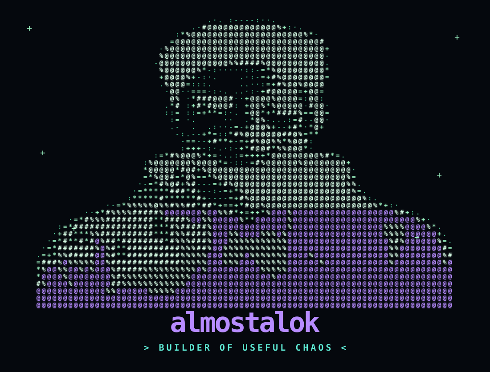

<!-- =========================================================
     ALMOSTALOK // PROFILE README
     Everything lives inside terminals.
     ========================================================= -->

<table width="100%">
<tr><td>
<pre>
●  ●  ●   almostalok@github:~$ boot --profile

[ OK ] identity loaded
[ OK ] coffee subsystem online
[ OK ] questionable ideas detected
[ OK ] shipping mode enabled
[WARN] sleep.exe missing — proceeding anyway

almostalok@github:~$ whoami
</pre>

  

<pre>
Name        > Alok Kumar Singh
Handle      > @almostalok
Role        > Developer / Product Builder
Currently   > Building Hospate
Focus       > Useful products, real people
Philosophy  > Ship > perfect
Learning    > Architecture + systems
Hobbies     > Code, coffee, ideas, overthinking
Fun fact    > My "quick fixes" tend to become full features.

almostalok@github:~$ echo $MOOD
> productive enough to be dangerous
</pre>

</td></tr>
</table>

<table width="100%">
<tr><td>
<pre>
●  ●  ●   almostalok@github:~$ system_status --verbose

SYSTEM STATUS
────────────────────────────────────────────────────────────────────────────
BUILDING       > Hospate                         [█████████░] 90%
LEARNING       > System Design                   [███████░░░] 70%
EXPLORING      > Product + Engineering           [██████░░░░] 60%
OPEN_TO        > Interesting problems             [████████░░] 80%
SLEEP          > command not found               [░░░░░░░░░░]  0%
COFFEE         > absolutely required              [██████████] 100%
────────────────────────────────────────────────────────────────────────────

$ systemctl status sleep.service

</td></tr>
</table>

<table width="100%">
<tr><td>
<pre>
●  ●  ●   almostalok@github:~$ currently_building --verbose

MISSION: HOSPATE
────────────────────────────────────────────────────────────────────────────
Cleaner workflows for real people — not another dashboard built only
for a screenshot.

idea
↓
product decision
↓
architecture
↓
code
↓
bug
↓
fix
↓
ship
↓
"wait... this actually works"

$ cat ./current_mission.txt

FULL_STACK_DEPTH=true
ARCHITECTURE_INSTINCTS=UPGRADING
OPEN_SOURCE=YES
PRODUCT_FEEDBACK=ALWAYS_WELCOME
DX_POLISH=IN_PROGRESS
LAUNCH_STRATEGY=LOADING...

$ ./ship.sh

</td></tr>
</table>

<table width="100%">
<tr><td>
<pre>
●  ●  ●   almostalok@github:~$ tech_stack --all

FRONTEND

HTML  CSS  JavaScript  TypeScript  React  Next.js  Tailwind

BACKEND

Node.js  Express  Python  Java  NestJS  Spring  GraphQL

DATA + INFRA

MongoDB  MySQL  PostgreSQL  Redis  Docker  AWS  Firebase  Linux

BUILD TOOLS

Git  Jest  Selenium  Electron  Figma  Arduino

MINDSET

  
   
  
   
  

<pre>
almostalok@github:~$ which stack
> found: "whatever gets the job done"
</pre>

</td></tr>
</table>

<table width="100%">
<tr><td>
<pre>
●  ●  ●   almostalok@github:~$ github --intelligence

[01] PROFILE SIGNALS
</pre>

  
  

<pre>
[02] TROPHY ENGINE
</pre>

  

<pre>
[03] GITHUB CORE STATS
</pre>

  
  

<pre>
[04] STREAK TELEMETRY
</pre>

  

<pre>
[05] CONTRIBUTION TIMELINE
</pre>

  

</td></tr>
</table>

<table width="100%">
<tr><td>
<pre>
●  ●  ●   almostalok@github:~$ github --visualize

[06] PROFILE SUMMARY
</pre>

  

  
  

<pre>
[07] 3D CONTRIBUTION SKYLINE
> generated by GitHub Actions
</pre>

  

<pre>
$ cat .github/workflows/profile-3d.yml
> Daily contribution visualization enabled.
> Manual trigger: GitHub → Actions → GitHub-Profile-3D-Contrib → Run workflow
</pre>

</td></tr>
</table>

<table width="100%">
<tr><td>
<pre>
●  ●  ●   almostalok@github:~$ snake_game --run

LOADING CONTRIBUTION GRID...
MAPPING COMMITS...
SPAWNING SNAKE...
OBJECTIVE: eat every contribution before the deadline.

STATUS > ONLINE
</pre>

  

<pre>
> Yes. Even my commits get chased.
> If this is green, I probably wasn't sleeping.

$ cat .github/workflows/snake.yml
> Contribution snake regenerated automatically.
</pre>

</td></tr>
</table>

<table width="100%">
<tr><td>
<pre>
●  ●  ●   almostalok@github:~$ github --deep_scan

METRIC CHANNELS
────────────────────────────────────────────────────────────────────────────
[01] CONTRIBUTION STATS      → commits / PRs / issues / stars
[02] LANGUAGE MIX            → top languages by repository usage
[03] STREAK TELEMETRY        → contribution consistency
[04] ACTIVITY GRAPH          → contribution timeline
[05] TROPHY ENGINE           → GitHub achievements
[06] PROFILE SUMMARY         → repository + profile analytics
[07] 3D SKYLINE              → contribution calendar in 3D
[08] SNAKE ENGINE            → contribution grid, but make it edible
[09] PROFILE SIGNAL          → followers + profile views
────────────────────────────────────────────────────────────────────────────

$ ./interpret_stats.sh

</td></tr>
</table>

<table width="100%">
<tr><td>
<pre>
●  ●  ●   almostalok@github:~$ connect --all

SOCIALS
────────────────────────────────────────────────────────────────────────────
LinkedIn     > https://linkedin.com/in/almostalok
Twitter      > https://twitter.com/almostalok
Instagram    > https://instagram.com/almostalok
Medium       > https://medium.com/@almostalok
dev.to       > https://dev.to/almostalok
Hashnode     > https://hashnode.com/almostalok
YouTube      > https://www.youtube.com/c/almostalok

CODING PROFILES
────────────────────────────────────────────────────────────────────────────
LeetCode     > https://www.leetcode.com/almostalok
HackerRank   > https://www.hackerrank.com/almostalok
Codeforces   > https://codeforces.com/profile/almostalok
CodeChef     > https://www.codechef.com/users/almostalok
HackerEarth  > https://www.hackerearth.com/almostalok
GeeksforGeeks> https://auth.geeksforgeeks.org/user/almostalok
Topcoder     > https://www.topcoder.com/members/almostalok

WEB
────────────────────────────────────────────────────────────────────────────
Portfolio    > https://almostalok.tech
Writing      > https://almostalokblogs.tech
Resume       > https://almostalokresume.tech
</pre>

</td></tr>
</table>

<table width="100%">
<tr><td>
<pre>
●  ●  ●   almostalok@github:~$ terminal --help

AVAILABLE COMMANDS
────────────────────────────────────────────────────────────────────────────
whoami              → know the human behind the commits
system_status       → inspect current operating condition
currently_building  → inspect current battlefield
tech_stack          → list tools of choice
github              → interrogate the contribution machine
achievements        → display trophy collection
snake_game          → release the snake
socials             → find me online
coding_profiles     → challenge me in public
life_advice         → highly questionable output
hire_me             → probably the most useful command
clear               → because clean terminals = clean minds
────────────────────────────────────────────────────────────────────────────

$ life_advice

ship something useful before polishing the README.
yes, I realize the irony.

$ sudo hire_me

</td></tr>
</table>

<table width="100%">
<tr><td>
<pre>
●  ●  ●   almostalok@github:~$ support --coffee

$ ./keep_alok_shipping.sh

dependency detected: coffee
funding optional
appreciation: dangerously effective

BUY ME A COFFEE
</pre>

  
  &nbsp;&nbsp;&nbsp;
  

<pre>
almostalok@github:~$ shutdown --graceful

> process still running.
> feature queue not empty.
> curiosity still active.
> sleep.service still missing.

"Still a work in progress...
but the commits are getting better."

made with ☕ + curiosity + questionable sleep schedules

almostalok // end of process
</pre>

</td></tr>
</table>
