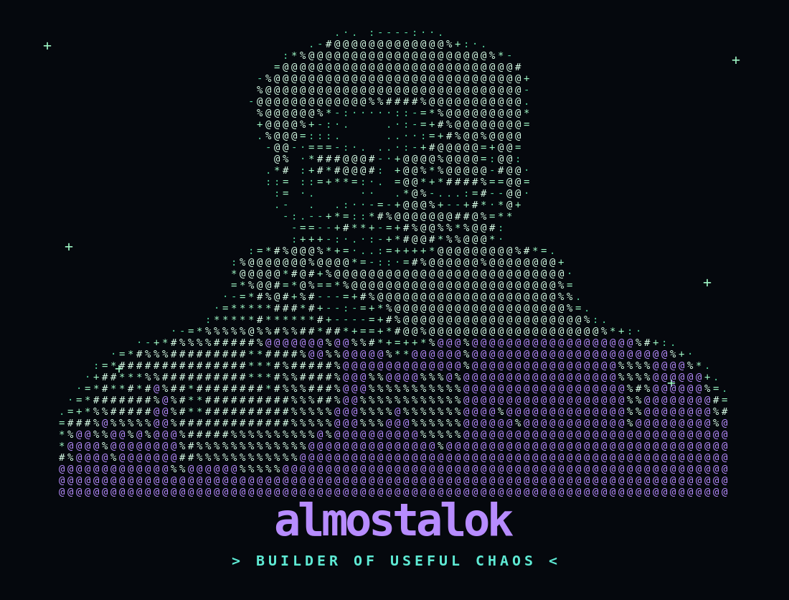

<!-- ============================================================
ALMOSTALOK // TERMINAL PROFILE
Pixel-matched layout target: supplied cyberpunk terminal dashboard.
============================================================= -->

<!-- TOP TERMINAL BAR -->
<table width="100%" cellpadding="0" cellspacing="0" border="1" bordercolor="#6d4aff" bgcolor="#070b11">
<tr><td>
<pre><code>🔴 🟡 🟢   <b>almostalok@github:~</b>                                      Mon Sep 07 19:02:01 2026  |  India 🇮🇳  |  100% Caffeine ☕</code></pre>
</td></tr>
</table>

 

<!-- ROW 1 : PROFILE + NEOFETCH -->
<table width="100%" cellpadding="5" cellspacing="5" border="0">
<tr>
<td width="50%" valign="top">
<table width="100%" cellpadding="0" cellspacing="0" border="1" bordercolor="#6d4aff" bgcolor="#070b11">
<tr><td>
<pre><code>🔴 🟡 🟢   <b>almostalok@dev:~$</b> whoami                                      ×</code></pre>

<pre><code>Code
Coffee
Chaos
Repeat. ☕

Same guy...
just better commits. :)

&gt; BUILDER OF USEFUL CHAOS &lt;
"Turning ideas into deployments,
one commit at a time."</code></pre>
</td></tr></table>
</td>

<td width="50%" valign="top">
<table width="100%" cellpadding="0" cellspacing="0" border="1" bordercolor="#6d4aff" bgcolor="#070b11">
<tr><td>
<pre><code>🔴 🟡 🟢   <b>almostalok@dev:~$</b> neofetch                                  ×

Name        &gt; Alok Kumar Singh
Handle      &gt; @almostalok
Role        &gt; Developer / Product Builder
Currently   &gt; Building <b>Hospate</b>
Location    &gt; India 🇮🇳
Focus       &gt; Useful products, real people
Education   &gt; Learning. Always.
Philosophy  &gt; Ship &gt; Perfection
Hobbies     &gt; Code, Coffee, Ideas, Overthinking
Fun Fact    &gt; My "quick fixes" become full features.

almostalok@dev:~$ _</code></pre>
</td></tr></table>

 

<table width="100%" cellpadding="0" cellspacing="0" border="1" bordercolor="#6d4aff" bgcolor="#070b11">
<tr><td>
<pre><code>🔴 🟡 🟢   <b>system_status@dev:~$</b> ./status                              ×

Building    &gt; Hospate          █████████░ 90%
Learning    &gt; System Design    ███████░░░ 70%
Exploring   &gt; Product + Growth ██████░░░░ 60%
Open To     &gt; Exciting Problems ████████░░ 80%
Caffeine    &gt; Necessary        ██████████ 100%

All systems operational! 🚀</code></pre>
</td></tr></table>
</td>
</tr>
</table>

<!-- ROW 2 : HOSPATE + TECH + SIGNALS -->
<table width="100%" cellpadding="5" cellspacing="5" border="0">
<tr>
<td width="40%" valign="top">
<table width="100%" cellpadding="0" cellspacing="0" border="1" bordercolor="#6d4aff" bgcolor="#070b11"><tr><td>
<pre><code>🔴 🟡 🟢   <b>currently_building@dev:~$</b> cat hospate.md             ×

HOSPATE
──────────────────────────────
Cleaner workflows for real people.

☑ idea
☑ product decision
☑ architecture
☑ code
☑ bug
☑ fix
☑ ship

&gt; Not another dashboard built only
&gt; to impress a screenshot.

"Real problems.
 Real users.
 Real impact."

$ ./ship.sh
&gt; compiling ideas...
&gt; deleting unnecessary complexity...
&gt; shipping anyway.</code></pre>
</td></tr></table>
</td>

<td width="30%" valign="top">
<table width="100%" cellpadding="0" cellspacing="0" border="1" bordercolor="#6d4aff" bgcolor="#070b11"><tr><td>
<pre><code>🔴 🟡 🟢   <b>tech_stack@dev:~$</b> ls                           ×

# Frontend
HTML   CSS   JS   TS
React  Next  Tailwind

# Backend
Node   Express   Python
Java   NestJS    GraphQL

# Databases & DevOps
MongoDB  PostgreSQL  MySQL
Redis    Docker      AWS

# Tools & Others
Git  Figma  Jest  Linux
Electron  Arduino  Selenium

&gt; frontend-first mindset
&gt; backend-driven discipline
&gt; product-focused execution</code></pre>

 
 

</td></tr></table>
</td>

<td width="30%" valign="top">
<table width="100%" cellpadding="0" cellspacing="0" border="1" bordercolor="#6d4aff" bgcolor="#070b11"><tr><td>
<pre><code>🔴 🟡 🟢   <b>github_stats@dev:~$</b> ./analyze                    ×

PROFILE SIGNALS
──────────────────────────────</code></pre>

<pre><code>"A green square cannot deploy an API.
But it looks pretty cool."</code></pre>
</td></tr></table>
</td>
</tr>
</table>

<!-- ROW 3 : TROPHIES + OVERVIEW -->
<table width="100%" cellpadding="5" cellspacing="5" border="0">
<tr>
<td width="50%" valign="top">
<table width="100%" cellpadding="0" cellspacing="0" border="1" bordercolor="#6d4aff" bgcolor="#070b11"><tr><td>
<pre><code>🔴 🟡 🟢   <b>github_trophies@dev:~$</b> ./trophies                    ×

ACHIEVEMENT ENGINE // ONLINE</code></pre>

</td></tr></table>
</td>

<td width="50%" valign="top">
<table width="100%" cellpadding="0" cellspacing="0" border="1" bordercolor="#6d4aff" bgcolor="#070b11"><tr><td>
<pre><code>🔴 🟡 🟢   <b>github_overview@dev:~$</b> ./stats                     ×</code></pre>
<table width="100%" cellpadding="3" cellspacing="3" border="0">
<tr>
<td width="50%"></td>
<td width="50%"></td>
</tr>
</table>
<pre><code>STREAK TELEMETRY</code></pre>

</td></tr></table>
</td>
</tr>
</table>

<!-- ROW 4 : 3D + ACTIVITY -->
<table width="100%" cellpadding="5" cellspacing="5" border="0">
<tr>
<td width="50%" valign="top">
<table width="100%" cellpadding="0" cellspacing="0" border="1" bordercolor="#6d4aff" bgcolor="#070b11"><tr><td>
<pre><code>🔴 🟡 🟢   <b>contribution_graph@dev:~$</b> ./show --3d             ×

&gt; 3D CONTRIBUTION GRAPH
&gt; More code. Higher grounds.</code></pre>

</td></tr></table>
</td>

<td width="50%" valign="top">
<table width="100%" cellpadding="0" cellspacing="0" border="1" bordercolor="#6d4aff" bgcolor="#070b11"><tr><td>
<pre><code>🔴 🟡 🟢   <b>activity@dev:~$</b> ./graph                         ×

&gt; contributions in the last year</code></pre>

</td></tr></table>
</td>
</tr>
</table>

<!-- ROW 5 : SNAKE + CODING + SOCIALS -->
<table width="100%" cellpadding="5" cellspacing="5" border="0">
<tr>
<td width="40%" valign="top">
<table width="100%" cellpadding="0" cellspacing="0" border="1" bordercolor="#6d4aff" bgcolor="#070b11"><tr><td>
<pre><code>🔴 🟡 🟢   <b>snake@dev:~$</b> ./play                            ×

LOADING CONTRIBUTION GRID...
MAPPING COMMITS...
SPAWNING SNAKE...
OBJECTIVE: eat every contribution.
STATUS &gt; ONLINE</code></pre>

<pre><code>&gt; Keep the streak alive! 🐍</code></pre>
</td></tr></table>
</td>

<td width="30%" valign="top">
<table width="100%" cellpadding="0" cellspacing="0" border="1" bordercolor="#6d4aff" bgcolor="#070b11"><tr><td>
<pre><code>🔴 🟡 🟢   <b>coding_profiles@dev:~$</b> ./links                  ×

⌕  LeetCode        HackerRank
⌕  Codeforces      AtCoder
⌕  CodeChef        GeeksforGeeks
⌕  HackerEarth     Topcoder

&gt; challenge me in public.</code></pre>
</td></tr></table>
</td>

<td width="30%" valign="top">
<table width="100%" cellpadding="0" cellspacing="0" border="1" bordercolor="#6d4aff" bgcolor="#070b11"><tr><td>
<pre><code>🔴 🟡 🟢   <b>connect@dev:~$</b> ./socials                    ×

Portfolio   almostalok.tech
Blog        almostalokblogs.tech
Resume      almostalokresume.tech
Twitter     @almostalok
LinkedIn    /in/alokkumarsingh
Instagram   @almostalok
YouTube     /c/almostalok

&gt; find me online.</code></pre>
</td></tr></table>
</td>
</tr>
</table>

<!-- ROW 6 : HELP + COFFEE + EXIT -->
<table width="100%" cellpadding="5" cellspacing="5" border="0">
<tr>
<td width="40%" valign="top">
<table width="100%" cellpadding="0" cellspacing="0" border="1" bordercolor="#6d4aff" bgcolor="#070b11"><tr><td>
<pre><code>🔴 🟡 🟢   <b>terminal@dev:~$</b> ./help                         ×

Available commands
──────────────────────────────
whoami      → Know more about me
projects    → See what I'm building
tech        → My tech stack
stats       → GitHub analytics
socials     → Find me online
hire        → Let's build together
clear       → Because clean terminals = happy mind

almostalok@dev:~$ sudo hire_me
&gt; permission granted.
&gt; let's build something worth shipping.</code></pre>
</td></tr></table>
</td>

<td width="30%" valign="top">
<table width="100%" cellpadding="0" cellspacing="0" border="1" bordercolor="#6d4aff" bgcolor="#070b11"><tr><td>
<pre><code>🔴 🟡 🟢   <b>coffee@dev:~$</b> ./support                      ×

DEPENDENCY DETECTED: coffee
FUNDING: optional
APPRECIATION: dangerously effective

If you like my work,
buy me a coffee.

$ ./keep_alok_shipping.sh</code></pre>

&nbsp;

<pre><code>"Caffeine powers better commits."</code></pre>
</td></tr></table>
</td>

<td width="30%" valign="top">
<table width="100%" cellpadding="0" cellspacing="0" border="1" bordercolor="#6d4aff" bgcolor="#070b11"><tr><td>
<pre><code>🔴 🟡 🟢   <b>exit@dev:~$</b> ./shutdown                      ×

Thanks for stopping by!
Let's build something amazing together.

(づ｡◕‿‿◕｡)づ

Stay curious. Keep building.

almostalok@dev:~$ _

&gt; process still running.
&gt; feature queue not empty.
&gt; curiosity still active.
&gt; sleep.service still missing.

"Still a work in progress...
but the commits are getting better."

almostalok // end of process</code></pre>
</td></tr></table>
</td>
</tr>
</table>

<!-- GitHub Actions assets expected by the README -->
