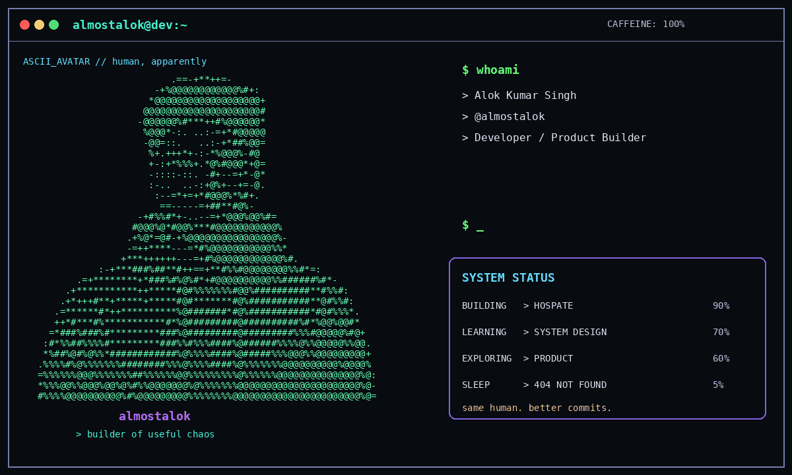

<!-- =========================================================
     ALMOSTALOK // PROFILE README
     Terminal-first. Slightly unhinged. Actually useful.
     ========================================================= -->

<div align="center">




<p>
  <a href="https://almostalok.tech"></a>
  <a href="https://almostalokblogs.tech"></a>
  <a href="https://almostalokresume.tech"></a>
</p>

</div>

---

## `$ whoami`

```text
                         .==-+**++=-
                      -+%@@@@@@@@@@@@%#+:
                    *@@@@@@@@@@@@@@@@@@@+
                   @@@@@@@@@@@@@@@@@@@@@#
                  -@@@@@@%#***++#%@@@@@@*
                   %@@@*-:. ..:-=+*#@@@@@
                   -@@=::.   ..:-+*##%@@=
                    %+.+++*+-:-*%@@@%-#@
                    +-:+*%%%+.*@%#@@@*+@=
                    -::::-::. -#+--=+*-@*
                     :-..  ..-:+@%+--+=-@.
                      :--=*+=+*#@@@%*%#+.
                       ==-----=+##**#@%-
                  -+#%%#*+-..--=+*@@@%@@%#=
                #@@@%@*#@@%***#@@@@@@@@@@@%
               .+%@*=@#-+%@@@@@@@@@@@@@@@@%-
               -=++****---=*#%@@@%@@@%%*
             +***++++++---=+#%@@@@@@@@@@@@%#.
          .+***###%##**#++==+**#%%#@@@@@@@@%%#*=:
       .=+********+*###%#%@%#*+#@@@@@@@@@@%%######%#*-
     .+***********++*****#@#%%%%%%%#@@%##########**#%%#:
    .+*+++#**+*****+*****#@#*******#@%###########**@#%%#:
   .=******#*++**********%@#######*#@%###########*#@#%%%*.
   ++*#***#%***********#*%@#########@##########%#*%@@%@@#*
  =*###%###%#*********###%@#########@#########%%%#@@@@@%#@+
 :#*%%##%%%%#*********###%%#%%%####%@######%%%%@%%@@@@@%%@@.
 *%##%@#%@%%*############%@%%%%####%@#####%%%@@@%%@@@@@@@@@+
.%%%%#%@%%%%%%%########%%%@%%%%####%@%%%%%%%@@@@@@@@@@%@@@@%
=%%%%%%@@@%%%%%%%##%%%%%%@@%%%%%%%%%@%%%%%%@@@@@@@@@@@@@@@%@:

                         almostalok
                  > BUILDER OF USEFUL CHAOS
```

```bash
$ neofetch --almostalok

Name        > Alok Kumar Singh
Handle      > @almostalok
Role        > Developer / Product Builder
Currently   > Building Hospate
Focus       > Useful products, real people
Philosophy  > Ship > perfect
Learning    > Architecture + systems
Hobbies     > Code, coffee, ideas, overthinking
Fun fact    > My "quick fixes" tend to become full features.

$ echo $MOOD
> productive enough to be dangerous
```

---

## `$ system status`

```text
BUILDING       > Hospate                         [█████████░] 90%
LEARNING       > System Design                   [███████░░░] 70%
EXPLORING      > Product + Engineering           [██████░░░░] 60%
OPEN_TO        > Interesting problems             [████████░░] 80%
SLEEP          > command not found               [░░░░░░░░░░]  0%
COFFEE         > absolutely required              [██████████] 100%
```

> `sleep.exe` has been deprecated. Nobody knows why. Nobody is fixing it.

---

## `$ currently_building`

### ⚔️ Hospate

Cleaner workflows for real people — **not another dashboard built solely to impress a screenshot.**

```text
idea
  ↓
product decision
  ↓
architecture
  ↓
code
  ↓
bug
  ↓
fix
  ↓
ship
  ↓
"wait... this actually works"
```

**Current upgrade quest:** full-stack depth + better architecture instincts.

**Collab mode:** open-source projects where code solves an actual pain point.

**Need backup on:** product feedback loops, DX polish and launch strategy.

---

## `$ tech_stack --compact`

<p align="center">
  
  <br /><br />
  
  <br /><br />
  
</p>

```text
frontend-first mindset  +  backend-driven discipline  +  product-focused execution
```

---

## `$ github --3d-build`

### 🏙️ Contribution Skyline

This is the **3D version of the GitHub contribution calendar**. It is generated automatically by GitHub Actions and committed back into the profile repository.

<p align="center">
  
</p>

<details>
<summary><b>⚙️ How the 3D graph works</b></summary>

<br />

The companion workflow is included at:

```text
.github/workflows/profile-3d.yml
```

Run it once from **GitHub → Actions → GitHub-Profile-3D-Contrib → Run workflow**. The action then generates the `profile-3d-contrib/` SVGs and refreshes them daily.

</details>

---

## `$ github --stats`

<div align="center">
  
  
</div>

<p align="center">
  
</p>

<p align="center">
  
</p>

---

## `$ git --commit-history`

<p align="center">
  
</p>

<p align="center"><i>Yes. Even my commits get chased.</i></p>

---

## `$ terminal --help`

```text
AVAILABLE COMMANDS

  whoami              → know the human behind the commits
  currently_building  → inspect current battlefield
  tech_stack          → list weapons of choice
  socials             → locate me on the internet
  coding_profiles     → challenge me in public
  life_advice         → highly questionable output
  hire_me             → probably the most useful command
  clear               → because clean terminals = clean minds

$ life_advice
> ship something useful before polishing the README.
> yes, I realize the irony.
```

---

## `$ connect --all`

<p align="center">
  <a href="https://linkedin.com/in/almostalok"></a>
  <a href="https://twitter.com/almostalok"></a>
  <a href="https://instagram.com/almostalok"></a>
  <a href="https://medium.com/@almostalok"></a>
  <a href="https://dev.to/almostalok"></a>
  <a href="https://hashnode.com/almostalok"></a>
</p>

<p align="center">
  <a href="https://stackoverflow.com/users/almostalok"></a>
  <a href="https://codepen.io/almostalok"></a>
  <a href="https://codesandbox.com/almostalok"></a>
  <a href="https://kaggle.com/almostalok"></a>
  <a href="https://www.youtube.com/c/almostalok"></a>
</p>

---

## `$ coding_profiles --duel`

<p align="center">
  <a href="https://www.leetcode.com/almostalok"></a>
  <a href="https://www.hackerrank.com/almostalok"></a>
  <a href="https://codeforces.com/profile/almostalok"></a>
  <a href="https://www.codechef.com/users/almostalok"></a>
  <a href="https://www.hackerearth.com/almostalok"></a>
  <a href="https://auth.geeksforgeeks.org/user/almostalok"></a>
  <a href="https://www.topcoder.com/members/almostalok"></a>
</p>

<p align="center"><b>Pick a platform. Drop a challenge. Let's duel in logic.</b></p>

---

## `$ blog --tail`

<!-- BLOG-POST-LIST:START -->
<!-- BLOG-POST-LIST:END -->

<p align="center"><i>Auto-updates from my writing feed — fresh notes when I publish.</i></p>

---

## `$ support --coffee`

<p align="center">
  <a href="https://www.buymeacoffee.com/almostalok">
    
  </a>
  &nbsp;&nbsp;&nbsp;
  <a href="https://ko-fi.com/almostalok">
    
  </a>
</p>

---

<div align="center">

```text
┌──────────────────────────────────────────────────────────────┐
│  $ shutdown                                                  │
│                                                              │
│  "Still a work in progress...                               │
│   but the commits are getting better."                      │
│                                                              │
│  made with ☕ + curiosity + questionable sleep schedules      │
│                                                              │
│  almostalok // end of process                                │
└──────────────────────────────────────────────────────────────┘
```


</div>
